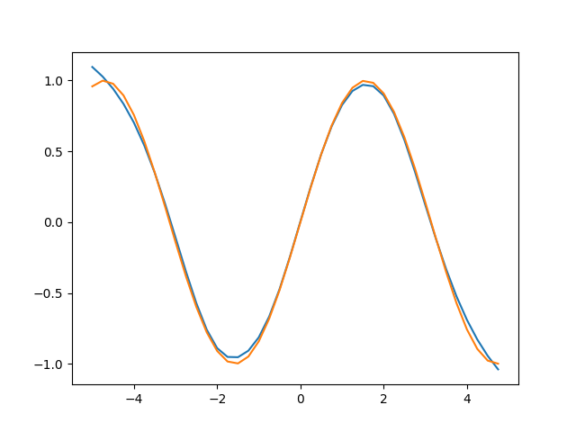

# fn
Function approximation with Neural Networks! 

Using shallow neural networks to learn mathematical functions.
Trigonometric functions, rational functions, polynomials, etc etc
Even boolean functions! (build a small CPU with neural networks as the logical gates?)

This is currently intended to function like sklearn's MLPRegressor object.


## Example, learning sin(x) on [-5, 5)
```python
import numpy as np
from fn import Fn

f = np.sin
X = np.arange(-5, 5, 0.25)
model = Fn(sizes=[1, 1096, 1096, 1096, 1], activations=['tanh', 'tanh', 'tanh'], loss='l1', optimizer="adam")
model.fit(X, f, epochs=750)

@np.vectorize
def model_(x):
    return model(torch.Tensor([x]).to(model.device)).detach().cpu()
    
y = model_(X)
plt.plot(X, y)
plt.plot(X, f(X))

plt.show()
```
the model will look like



A trained model can easily be used as a function

```python
from math import pi
import numpy as np
from fn import Fn

f = np.sin
X = np.arange(0, 2*pi + 1, 0.25)

model = Fn(sizes=[1, 1096, 1096, 1096, 1], activations=['tanh', 'tanh', 'tanh'], loss='l1', optimizer="adam")
# Fit the model on sin(x) over the interval [0, 2pi]
model.fit(X, f, epochs=250)

# using our model to compute sin(0)
y = model(0.0).item()
print(y)
```

# Theory
The Universal Approximation Theorem states that a neural network with a single hidden layer can approximate any continious function on a closed interval to arbitrary error

An extreme example,

## Learning sin(x) on [0, 2π] with a single hidden layer (500k neurons)

```python
from math import pi
f = np.sin
X = np.arange(0, 2*pi + 1, 0.25)

model = Fn(sizes=[1, 500_000, 1], activations=['tanh'], loss='l2')
model.fit(X, f, epochs=500)

@np.vectorize
def model_(x):
    return model(torch.Tensor([x]).to(model.device)).detach().cpu()

y = model_(X)

plt.plot(X, y)
plt.plot(X, f(X))

plt.show()
```


not bad for 1 hidden layer.